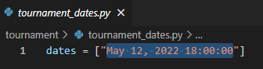
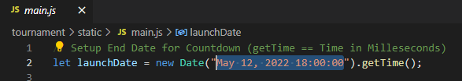
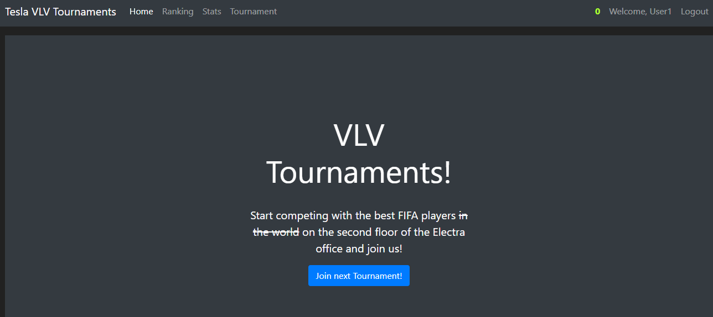
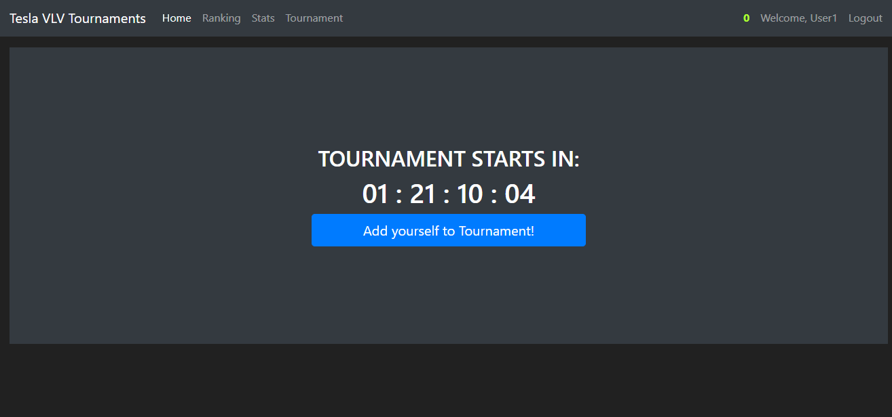
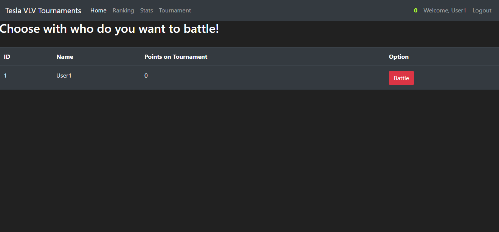
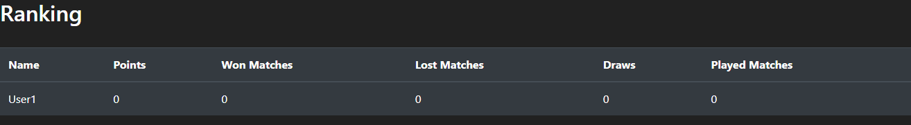

# Tournament-VLV

## Tournament-VLV is flask project to track scores on FIFA tournaments between VLV members

1. **SET time of tournament in tournament_dates.py and main.js**

2. **Register and log into your account**

3. **Join to a tournament** 

4. **After date set in tournament_dates.py and main.js ends you will be able to challenge players added to a tournament**

5. **You can track your scores on ranking.html**
